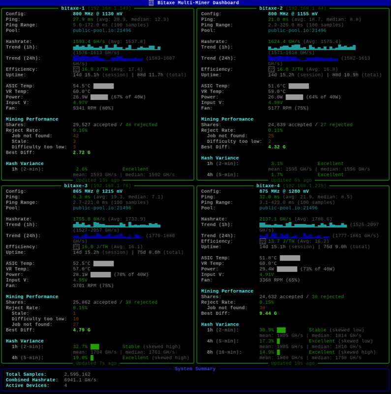
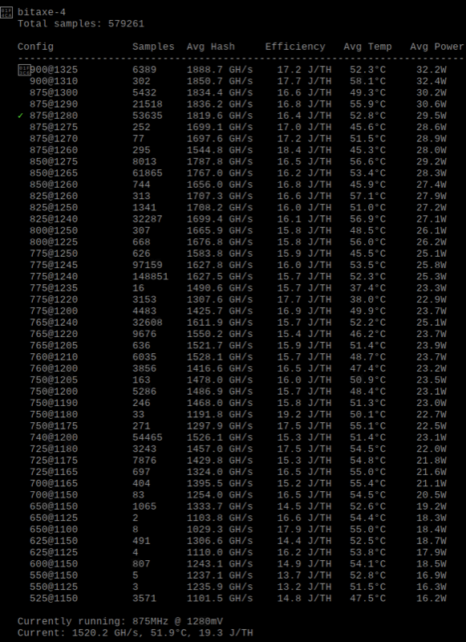
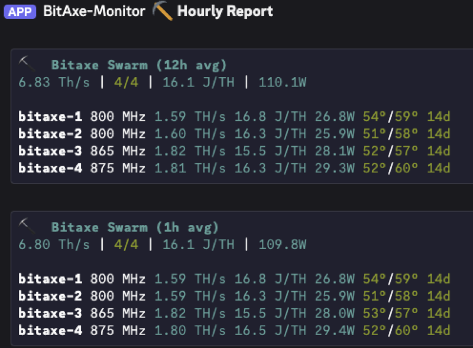
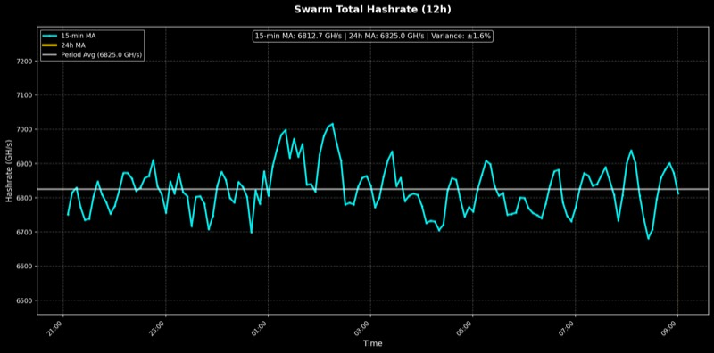
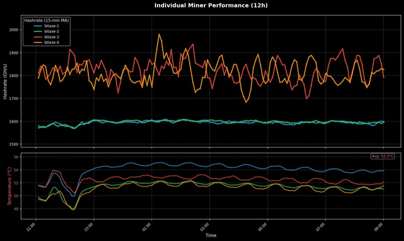

# Bitaxe Multi-Miner Performance Logger

A Python-based monitoring and analysis tool for Bitaxe ASIC Bitcoin miners. Automatically collects performance metrics (hashrate, efficiency, temperature, voltage) and segments data by clock configurations to identify optimal operating parameters.

## Features

### Core Monitoring
- **Multi-device monitoring**: Poll multiple Bitaxe miners simultaneously
- **Automatic config detection**: Segments data by frequency/voltage settings
- **Time-series storage**: SQLite database with efficient indexing
- **Efficiency calculations**: J/TH and GH/W metrics computed in real-time
- **Analysis tools**: Compare configurations, identify optimal settings
- **Safety monitoring**: Temperature warnings and alerts

### Terminal Dashboard
- **Real-time dashboard**: Live terminal UI with Rich formatting
- **Variance analysis**: Multi-timeframe hashrate stability metrics
- **Uptime tracking**: Automatic restart detection with total uptime
- **Performance trends**: Sparkline graphs and moving averages
- **Lite mode**: Compact view for monitoring 4+ miners

### Discord Bot
- **Auto-reporting**: Hourly status updates to Discord channel
- **Smart averaging**: 1h averages for reliable hashrate/efficiency stats
- **Chart generation**: Swarm and per-miner performance graphs
- **Interactive commands**: On-demand stats, reports, and health checks
- **Remote control**: Restart miners, adjust clock/voltage/fan via Discord
- **Alerts**: Real-time notifications for offline miners and overheating

## Screenshots

### Terminal Dashboard


### Stats Report


### Discord Bot


### Swarm Hashrate Chart


### Per-Miner Details Chart


## Quick Start

### 1. Setup

```bash
# Clone the repository
git clone https://github.com/ldevine15/bitaxe-monitor.git
cd bitaxe-monitor

# Create virtual environment
python3 -m venv venv
source venv/bin/activate  # On Windows: venv\Scripts\activate

# Install dependencies
pip install -r requirements.txt
```

### 2. Configuration

Copy `config.yaml.example` to `config.yaml` and update with your Bitaxe IPs:

```yaml
devices:
  - name: "bitaxe-1"
    ip: "192.168.1.100"
    enabled: true
  - name: "bitaxe-2"
    ip: "192.168.1.101"
    enabled: true

logging:
  poll_interval: 10
  database_path: "./data/metrics.db"
  log_level: "INFO"

safety:
  max_temp_warning: 65
  max_temp_shutdown: 70
```

### 3. Start Monitoring

```bash
# Start data collection (required)
python run_logger.py

# Terminal dashboard
python dashboard.py         # Full dashboard fits 1-4 easily
python dashboard.py --lite  # Compact view for 4+ miners
```

The logger will:
- Poll all enabled devices every 10 seconds (configurable)
- Automatically detect current clock configurations
- Store metrics per clock configuration in SQLite database
- Display real-time status in console
- Alert on temperature warnings

### 4. Analyze Data

```bash
# View all configurations with average performance (sorted by frequency)
python stats.py stats

# View configuration performance summary
python stats.py compare bitaxe-1

# View summary statistics
python stats.py summary bitaxe-1

# Export data to CSV
python stats.py export bitaxe-1 results.csv
```

---

## Discord Bot Setup

### Step 1: Create Discord Bot

1. Go to https://discord.com/developers/applications
2. Click **New Application**, name it (e.g., "Bitaxe Monitor")
3. Go to **Bot** tab, click **Add Bot**
4. Enable **MESSAGE CONTENT INTENT** (required!)
5. Click **Reset Token** and copy your bot token

### Step 2: Invite Bot to Server

1. Go to **OAuth2 > URL Generator**
2. Select scopes: `bot`
3. Select permissions: `Send Messages`, `Attach Files`, `Read Message History`
4. Copy the URL and open it to invite the bot

### Step 3: Get Channel ID

1. In Discord, go to **User Settings > Advanced > Enable Developer Mode**
2. Right-click your target channel > **Copy Channel ID**

### Step 4: Configure

Create `.env` file in project root:
```bash
DISCORD_BOT_TOKEN=your_bot_token_here
```

Add Discord section to `config.yaml`:
```yaml
discord:
  enabled: true
  token: "${DISCORD_BOT_TOKEN}"
  command_prefix: "!"

  auto_report:
    enabled: true
    channel_name: "mining"
    channel_id: 1234567890123456789   # Your channel ID
    schedule: "0 * * * *"             # Every hour
    include_charts: true
    graph_lookback_hours: 12

  alerts:
    enabled: true
    channel_id: 1234567890123456789
    check_interval_minutes: 1
    offline_threshold_minutes: 2

  control:
    enabled: true
    admin_role_id: 0                  # 0 = everyone can use
```

See `config.yaml.example` for all available options.

### Step 5: Install & Run

```bash
# Install Discord dependencies
pip install -r requirements-discord.txt

# Make sure logger is running first
python run_logger.py &

# Start Discord bot
python discord_bot.py
```

You should see:
```
INFO - Connected to Discord as Bitaxe Monitor#1234
INFO - Auto-report scheduled: 0 * * * *
INFO - Bot ready! Monitoring 4 devices
```

### Discord Commands

| Command | Description |
|---------|-------------|
| `!status` | Instant snapshot of all miners |
| `!stats` | Detailed statistics report |
| `!report [hours]` | Performance report with charts (default: 24h) |
| `!report 7d` | 7-day report |
| `!miner <name>` | Individual miner deep-dive |
| `!health` | Check for warnings and issues |
| `!help` | Show all commands |

**Control Commands** (if enabled):
| Command | Description |
|---------|-------------|
| `!restart <miner>` | Restart a specific miner |
| `!restart-all` | Restart all miners |
| `!clock <miner> <MHz>` | Set frequency |
| `!voltage <miner> <mV>` | Set core voltage |
| `!fan <miner> <%>` | Set fan speed |

### Troubleshooting

| Error | Solution |
|-------|----------|
| "Discord bot is not enabled" | Set `discord.enabled: true` in config.yaml |
| "DISCORD_BOT_TOKEN not set" | Create `.env` file with your token |
| "Database not found" | Start `run_logger.py` first |
| Bot doesn't respond | Enable MESSAGE CONTENT intent in Discord dev portal |
| "Channel not found" | Verify channel ID and bot permissions |

### Additional Discord Documentation

For more detailed setup instructions, see the `docs/` folder:

| Document | Description |
|----------|-------------|
| [docs/discord-setup.md](docs/discord-setup.md) | Complete setup guide with screenshots and systemd deployment |
| [docs/GET-CHANNEL-ID.md](docs/GET-CHANNEL-ID.md) | Quick guide to find your Discord channel ID |
| [docs/discord-bot.md](docs/discord-bot.md) | Technical documentation and architecture details |

---

## Project Structure

```
bitaxe-monitor/
├── README.md                   # This file
├── LICENSE                     # MIT License
├── requirements.txt            # Core dependencies
├── requirements-discord.txt    # Discord bot dependencies
├── config.yaml.example         # Example configuration
│
├── run_logger.py               # Data collection daemon
├── dashboard.py                # Real-time terminal dashboard
├── discord_bot.py              # Discord bot entry point
├── stats.py                    # Statistics & analysis CLI
│
├── src/                        # Source code
│   ├── api_client.py          # Bitaxe REST API client
│   ├── database.py            # SQLite operations
│   ├── models.py              # Data models
│   ├── logger.py              # Main logging daemon
│   ├── analyzer.py            # Analysis tools
│   └── discord/               # Discord bot module
│       ├── bot.py             # Bot commands & logic
│       ├── config.py          # Discord configuration
│       └── chart_generator.py # Graph generation
│
├── data/                       # Data directory (gitignored)
│   ├── metrics.db             # SQLite database
│   └── *.log                  # Application logs
│
└── docs/                       # Additional documentation
    ├── discord-setup.md       # Detailed Discord bot setup guide
    ├── GET-CHANNEL-ID.md      # How to find Discord channel IDs
    └── discord-bot.md         # Technical docs & architecture
```

## Key Metrics

- **Hashrate**: Mining performance in GH/s (gigahash per second)
- **J/TH**: Energy efficiency in joules per terahash (lower is better)
- **GH/W**: Hash efficiency in gigahash per watt (higher is better)
- **Temperature**: ASIC and voltage regulator temps in °C
- **Power**: Total power consumption in watts

## Security & Privacy

- Everything runs on your local network
- No cloud services or external APIs (except Discord bot if enabled)
- Database is local SQLite file
- Only you can access your data

## Safety Notes

- All overclocking is done at your own risk

## References

- [ESP-Miner Firmware](https://github.com/bitaxeorg/ESP-Miner)
- [Bitaxe Hardware](https://github.com/skot/bitaxe)
- [Bitaxe API Documentation](https://osmu.wiki/bitaxe/api/)

## License

MIT License - See LICENSE file for details
